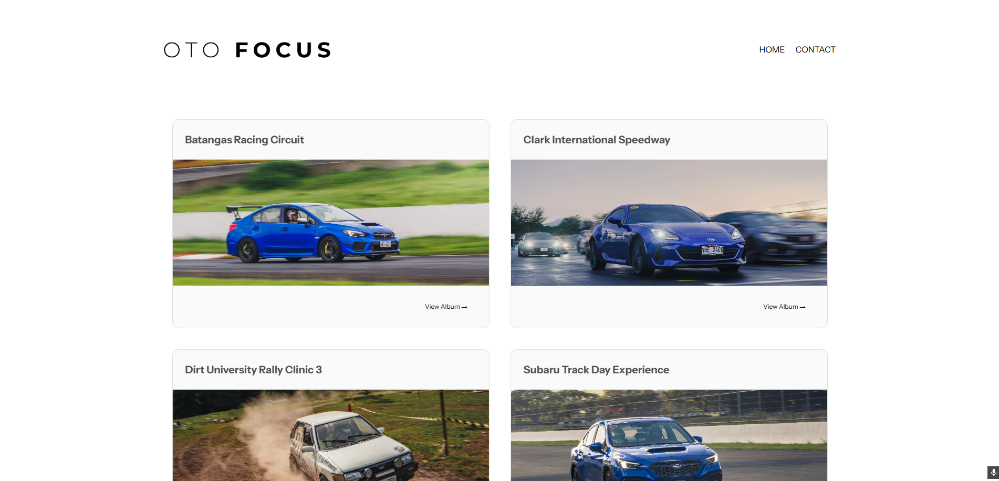

</img>

[**otofocus.vercel.app**](https://otofocus.vercel.app)

<h2>About</h2>

Apart from coding, I’m really into photography and enjoy attending track days. I’ve combined these interests by capturing moments at the track, which has also become a source of income. Using my web development skills, I decided to create a photography portfolio to showcase my work.

<h2>Technologies Used</h2>

Written on <b><a href='https://www.typescriptlang.org/' target="_blank" rel="noopener noreferrer">TypeScript</a></b>. Built using <b><a href='https://nextjs.org/' target="_blank" rel="noopener noreferrer">Next.JS</a></b>. Styled with <b><a href='https://tailwindcss.com/' target="_blank" rel="noopener noreferrer">Tailwind CSS</a></b>. Hosted on <b><a href='https://vercel.com/' target="_blank" rel="noopener noreferrer">Vercel</a></b>.

  </img>

<h3>Other Tools Used</h3>

- <a target="_blank" rel="noopener noreferrer" href="https://github.com/igordanchenko/react-photo-album">react-photo-album</a>
- <a target="_blank" rel="noopener noreferrer" href="https://github.com/igordanchenko/yet-another-react-lightbox">yet-another-react-lightbox</a>
- <a target="_blank" rel="noopener noreferrer" href="https://github.com/motiondivision/motion">motion</a>

<h2>License</h2>

[![CC BY-NC-ND 4.0][cc-by-nc-nd-shield]][cc-by-nc-nd]

OtoFocus © 2025 by Randale Porciuncula is licensed under CC BY-NC-ND 4.0

This work is licensed under a
[Creative Commons Attribution-NonCommercial-NoDerivs 4.0 International License][cc-by-nc-nd].

[![CC BY-NC-ND 4.0][cc-by-nc-nd-image]][cc-by-nc-nd]

[cc-by-nc-nd]: http://creativecommons.org/licenses/by-nc-nd/4.0/
[cc-by-nc-nd-image]: https://licensebuttons.net/l/by-nc-nd/4.0/88x31.png
[cc-by-nc-nd-shield]: https://img.shields.io/badge/License-CC%20BY--NC--ND%204.0-lightgrey.svg
